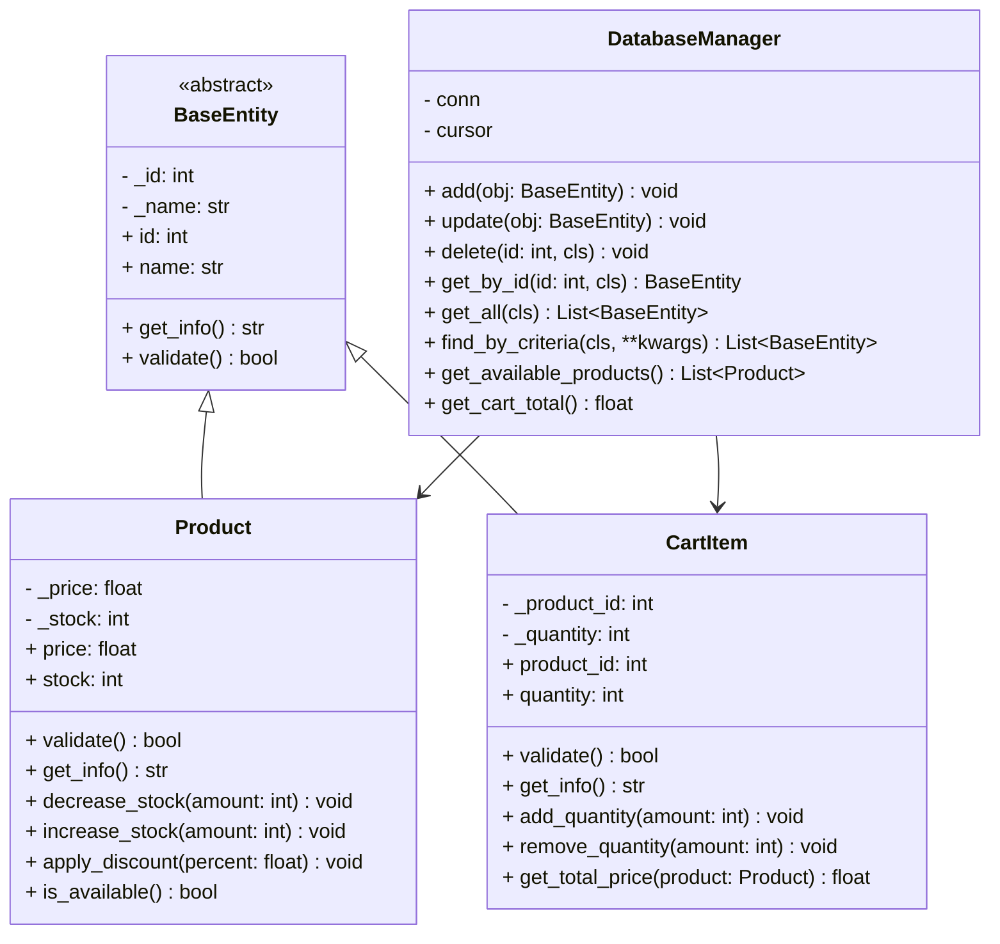

# Интернет-магазин (Товары/Корзина) (Python + SQLite)

## Задача

Закрепление принципов объектно-ориентированного программирования (инкапсуляция, наследование, полиморфизм, абстракция) на примере разработки модели предметной области **«Интернет-магазин (Товары/Корзина)»** с последующей интеграцией с базой данных.

---

## Описание проекта

Данный проект представляет собой систему интернет-магазина, реализованную с использованием объектно-ориентированного подхода и базы данных SQLite.

Система моделирует работу с товарами и корзиной, включая хранение данных, применение бизнес-логики и взаимодействие с базой данных через отдельный слой управления.

Система поддерживает:

* хранение и управление товарами (добавление, обновление, удаление)
* учет количества товаров на складе (остатков)
* применение бизнес-логики (скидки, изменение количества, проверка наличия)
* управление корзиной пользователя
* расчет стоимости отдельных позиций и общей суммы корзины
* поиск объектов по заданным критериям
* валидацию данных перед сохранением
* работу с базой данных через отдельный менеджер

---

## Архитектура проекта

Проект построен по принципу разделения ответственности (Separation of Concerns):

* **Models** (`models/`) → описывают сущности (Product, CartItem)
* **DatabaseManager** (`database/`) → бизнес-логика и работа с БД
* **SQLite** → хранение данных

---

## UML-диаграмма классов



---

## Модель данных (База Данных)

### Таблица `products`

| Поле  | Тип     | Описание        |
| ----- | ------- | --------------- |
| id    | INTEGER | Первичный ключ  |
| name  | TEXT    | Название товара |
| price | REAL    | Цена            |
| stock | INTEGER | Остаток         |

---

### Таблица `cart_items`

| Поле       | Тип     | Описание         |
| ---------- | ------- | ---------------- |
| id         | INTEGER | Первичный ключ   |
| name       | TEXT    | Название корзины |
| product_id | INTEGER | ID товара        |
| quantity   | INTEGER | Количество       |

---

## Основные компоненты

### BaseEntity

Абстрактный базовый класс:

* приватные поля `_id`, `_name`
* методы `get_info()` и `validate()`

---

### Product

Модель товара:

* хранит цену и остаток
* методы:

  * `decrease_stock()`
  * `apply_discount()`
  * `is_available()`

---

### CartItem

Элемент корзины:

* хранит количество
* методы:

  * `add_quantity()`
  * `get_total_price()`

---

### DatabaseManager

Основной менеджер:

```python
add(obj)
update(obj)
delete(id, cls)
get_by_id(id, cls)
get_all(cls)
find_by_criteria(cls, **kwargs)
```

Дополнительно:

* `get_available_products()`
* `get_cart_total()`

---

## Запуск проекта

```bash
python main.py
```

После запуска создаётся база данных:

```
shop.db
```

---

## Демонстрация

В `main.py` реализовано:

* создание товаров
* применение скидок
* изменение остатков
* работа корзины
* поиск
* расчет суммы
* удаление
* обработка ошибок

---

## Структура проекта

```
internet-shop/
├── database/
│   ├── db_manager.py
│   └── schema.sql
├── models/
│   ├── base.py
│   ├── product.py
│   └── cart_item.py
├── main.py
└── README.md
```

---

## Вывод

В ходе работы реализована модель интернет-магазина с использованием принципов ООП и базы данных SQLite.
Реализована бизнес-логика, взаимодействие с базой данных и архитектура приложения.

---
